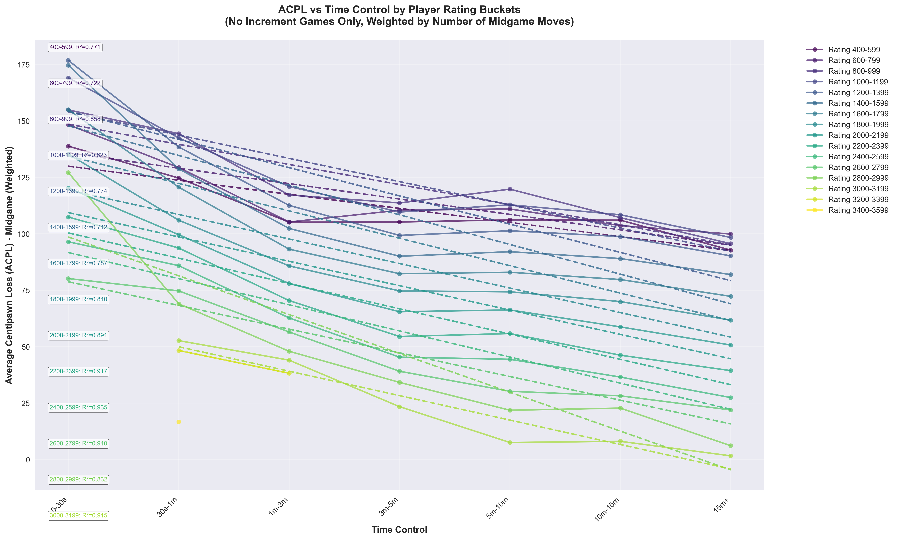

# Chess Bidding Analysis

A data-driven approach to **Armageddon chess bidding** using large-scale game analysis from Lichess.

## What is Armageddon Chess?

Armageddon is a decisive tiebreak format where players bid on how much time they need to win with White. The player who bids the lowest time gets White, while the other player gets Black with draw odds (a draw counts as a win for Black).

## Project Goal

This project analyzes **average centipawn loss (ACPL)** across different time controls and rating levels to make more informed bidding decisions. By understanding how player accuracy degrades at various time controls, you can better assess the true value of time in Armageddon scenarios.

## Data Source

All game data is sourced from the [Lichess Open Database](https://database.lichess.org/), which provides millions of analyzed games with Stockfish evaluations.

## Example Output



The analysis shows average centipawn loss across different time controls and rating ranges, revealing how time pressure affects player accuracy.

## Usage

### 1. Extract Game Metrics

```bash
python chess_analyzer.py --input data/your_pgn_file.pgn --output results.csv
```

The analyzer processes PGN files with evaluation data and outputs metrics for each player including:
- Average centipawn loss (ACPL) during middlegame
- Inaccuracies, mistakes, and blunders
- Time control and rating information

### 2. Analyze and Visualize

```bash
python acpl_timecontrol_analysis.py
```

The analysis script loads the CSV output, groups time controls into buckets (0-30s, 30s-1m, 1m-3m, 3m-5m, etc.), creates rating buckets (200-point intervals), and generates visualizations showing how ACPL varies across time controls and rating levels.

## Performance

The chess analyzer achieves **~6x speedup** through several optimizations:
- **Multithreading**: Parallel batch processing of games using ThreadPoolExecutor
- **PyPy**: JIT compilation for faster Python execution
- **Streaming architecture**: Games are processed in batches without loading the entire file into memory
- **Profiling-driven optimization**: Hot paths identified and optimized