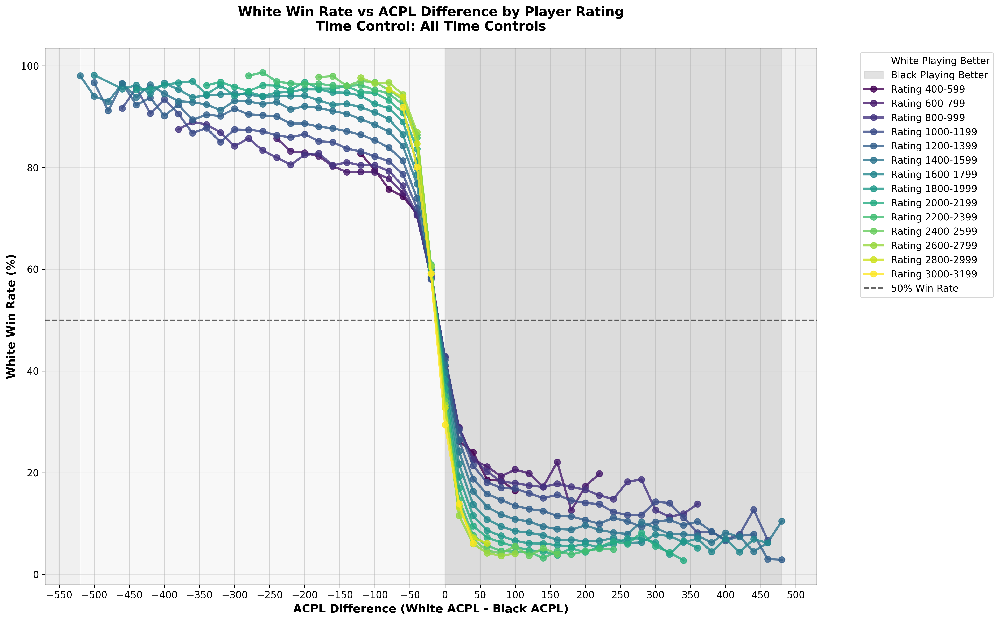

# Chess Bidding Analysis

A data-driven approach to **Armageddon chess bidding** using large-scale game analysis from Lichess.

## What is Armageddon Chess?

Armageddon is a decisive tiebreak format where players bid on how much time they need to win with White. The player who bids the lowest time gets White, while the other player gets Black with draw odds (a draw counts as a win for Black).

## Project Goal

This project analyzes **average centipawn loss (ACPL)** across different time controls and rating levels to make more informed bidding decisions. By understanding how player accuracy degrades at various time controls, you can better assess the true value of time in Armageddon scenarios.

## Data Source

All game data is sourced from the [Lichess Open Database](https://database.lichess.org/), which provides millions of analyzed games with Stockfish evaluations.

## Example Output

### ACPL by Time Control


Average centipawn loss across time controls and rating ranges, showing how time pressure affects player accuracy.

### Win Rates and Draw Odds



Win rate and draw odds analysis by ACPL difference, showing how playing accuracy translates to game outcomes across rating levels.

## Usage

### 1. Extract Game Metrics

```bash
python chess_analyzer.py --input data/your_pgn_file.pgn --output results.csv
```

The analyzer processes PGN files with evaluation data and outputs metrics for each player including:
- Average centipawn loss (ACPL) during middlegame
- Inaccuracies, mistakes, and blunders
- Time control and rating information

### 2. Analyze Time Control Impact

```bash
python acpl_timecontrol_analysis.py
```

Analyzes how ACPL varies across time controls and rating levels. Categorizes games by Lichess standards (Bullet: <3min, Blitz: 3-8min, Rapid: 8-25min, Classical: 25+min) and creates rating buckets (200-point intervals).

### 3. Analyze Game Outcomes

```bash
# Generate all graphs
python acpl_outcome_analysis.py

# Generate only combined graphs (faster)
python acpl_outcome_analysis.py --combined-only
```

Analyzes the relationship between ACPL differences and game outcomes:
- **Win rates**: How ACPL advantage translates to winning probability
- **Draw rates**: How equal play affects draw likelihood (higher-rated players draw more)
- **Draw odds**: Win rates when Black has draw odds (draws count as Black wins)

Graphs can be generated by time control category, rating bucket, or combined across all games.

## Key Insights

- **Time pressure significantly impacts accuracy**: ACPL increases as time controls get shorter, with the effect more pronounced at lower rating levels
- **ACPL strongly predicts outcomes**: ~50 ACPL advantage correlates with 85-95% win rate across all rating levels (r ≈ -0.95)
- **Draw rates increase with skill and equal play**: Higher-rated players (2200+) draw 15-20% of games when ACPL is equal, compared to <5% for lower-rated players
- **Draw odds are valuable**: When Black has draw odds, White needs significantly better play to achieve 50% winning probability

## Performance

The chess analyzer achieves **~6x speedup** through several optimizations:
- **Multithreading**: Parallel batch processing of games using ThreadPoolExecutor
- **PyPy**: JIT compilation for faster Python execution
- **Streaming architecture**: Games are processed in batches without loading the entire file into memory
- **Profiling-driven optimization**: Hot paths identified and optimized